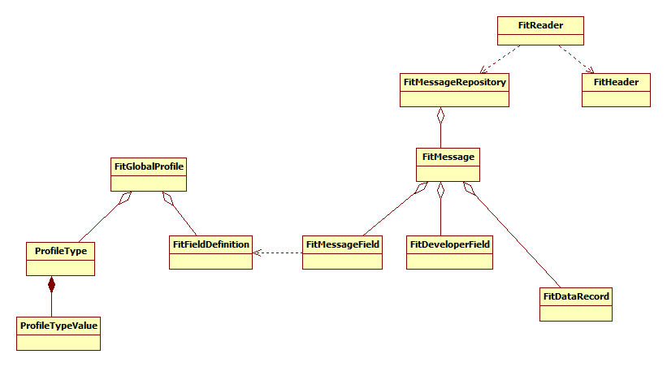

# FitReader
## FIT
FitReader is a library to read ANT/Garmin _.FIT_ files. FIT stands for _Flexible and Interoperable Data Transfer_ and is a Garmin protocol widely used for storing and transfering sports and activity related data. FitReader can be used to read and decode the FIT content for further processing.

The [FIT protocol](https://developer.garmin.com/fit/overview/) is based on Messages, each consisting of Fields of a certain data type. Possible Messages, Fields and Types are defined in the _Global FIT Profile_ which is part of the [Garmin FIT SDK](https://developer.garmin.com/fit/download/), in the form of an excel sheet Profile.xlsx.

A device, for example my Edge830 cycle computer, support a certain subset of the Global FIT Profile. This subset is called the Device Profile.

---
Note: Apparently with updates of the Global FIT Profile, messages are added. However, sometimes Message definitions are _removed_. An example is the Waypoints message (ID 29). However, this message is used by devices like the Edge 810 and Edge 830. Being not present in the Global FIT Profile means this message is no longer recognized in the FIT data.

---


## Working of the software
.FIT files are converted to a **FitRecordRepository**, consisting of **FitMessage**s for each .FIT defined FIT Message.

A **FitMessage** consists of
* **FitMessageField**s defining the local message structure referring to the Global FIT profile
* optional **FitDeveloperField**s defining developer defined fields.
* **FitDataRecord**s, records containing data conform the field definitions

The global FIT profile is read into **FitGlobalProfile** from the excel file enclosed in de Garmin/ANT FIT SDK. The profile definition consists of data types and global message field definitions.

**FitReader** is the entry point of the library. It offers functions to read FIT files. The main fun. ction is **FitReader:readFile()**, which does the reading and conversion and results in the **FitRecordRepository** containing the read **FitMessage**s. The **FitMessageRepository** can be used to obtain the message definition and data. 




Messages (message and field names) are defined in /src/main/resources/Profile.xlsx (this file originates from the .FIT SDK that can be downloaded at the [ANT site](https://www.thisisant.com/resources/fit); this SDK also contains PDFs describing the .FIT format). However, implementers like Garmin appear to have added their own proprietary fields which are not defined in the Excel sheet. 

Developer fields within a message are defined in the FIT file itself, by means of two regular fields (_developer_data_id_ and _field_description_).

---
**Redefinition of Global Message Types**

The FIT file is a collection of data records, each data record contains values accroding to a message definition. This message definition is defined in the FIT file by a definition record (which refers to the Global FIT Profile). 
A message definition is identified by a Local Message Type (identifying) encoded in 4 bits. Therefore only 16 Local Message Types can be maintained. Data records refer to this Local Message Type. The interpreter uses this Local Message TYpe to attach a Data Record to a Message Definition. 

With increasing possibilities of devices, the number of possible FIT message definitions increases and a device like my Edge830 uses more than 16 message definitions. Fortunatelly the FIT spefication allows for reuse of the Local Message Type: a Local Message Type can be reused for an other Message Definition Record. This implicates that within one FIT file Messages are defined  and redefined all the time. 

*A not so obvious implication is (apparently) that the same Message, like "record", is available in the file under various Local Message Types.*

Therefore the class FitMessageRepository offers the method **getAllMessages(String messageName)**, returning a list of all Messages with the given Message Name (including the data records). This list must be parsed in order to find all Data Records belonging to that Message type.

---

# Building
Use Maven to compile the source files into /target. The project is recognized by Netbeans as Maven project and can be imported. Or build manually:

```
mvn clean install
```

This results in two jar files: one library and one for the javadoc. Usage is illustrated in the test files.


# Dependencies
The software uses 
- hirondelle-date4j-1.5.1.jar


# Version history
* 1.0: Initial version
* 2.0: Major improvement, rename, bug fixes

# Information
Javadoc: Refer to the Javadoc in the /target file.
Blog:    http://blog.studioblueplanet.net/?page_id=468


Garmin Track Converter
The Garmin track converter uses this library to convert .FIT tracks to .GPX format

Source: https://github.com/scubajorgen/GarminTrackConverter

# License
This software is published under the MIT license:

Copyright (c) 2023 Jörgen

Permission is hereby granted, free of charge, to any person obtaining a copy
of this software and associated documentation files (the "Software"), to deal
in the Software without restriction, including without limitation the rights
to use, copy, modify, merge, publish, distribute, sublicense, and/or sell
copies of the Software, and to permit persons to whom the Software is
furnished to do so, subject to the following conditions:

The above copyright notice and this permission notice shall be included in all
copies or substantial portions of the Software.

THE SOFTWARE IS PROVIDED "AS IS", WITHOUT WARRANTY OF ANY KIND, EXPRESS OR
IMPLIED, INCLUDING BUT NOT LIMITED TO THE WARRANTIES OF MERCHANTABILITY,
FITNESS FOR A PARTICULAR PURPOSE AND NONINFRINGEMENT. IN NO EVENT SHALL THE
AUTHORS OR COPYRIGHT HOLDERS BE LIABLE FOR ANY CLAIM, DAMAGES OR OTHER
LIABILITY, WHETHER IN AN ACTION OF CONTRACT, TORT OR OTHERWISE, ARISING FROM,
OUT OF OR IN CONNECTION WITH THE SOFTWARE OR THE USE OR OTHER DEALINGS IN THE
SOFTWARE.
